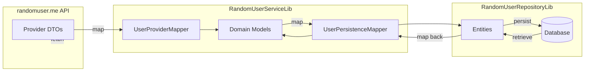

# RandomUserApplication

RandomUserApplication is a **modular Java Spring Boot project** built with a clean layered architecture.  
It consumes random user data from the [randomuser.me](https://randomuser.me/) API, transforms it into a local domain model, persists it, and exposes RESTful endpoints.

---

## Project Structure

```
RandomUserApplication/
├── RandomUserApplication     # Main Spring Boot application (entry point, controllers, API exposure)
├── RandomUserServiceLib      # Service Layer (business logic, mapping between provider/domain/entity)
├── RandomUserRepositoryLib   # Repository Layer (persistence abstraction, database interaction)
├── RandomUserMeServiceLib    # Provider Layer (external API client, DTOs from randomuser.me)
```

### Layered Responsibilities
- **RandomUserMeServiceLib**  
  - Handles communication with external API (`randomuser.me`) using `RestTemplate`.  
  - Defines provider DTOs (`User`, `Location`, `Name`, etc.) matching the API’s JSON structure.

- **RandomUserServiceLib**  
  - Defines **Domain Models** (`UserProfile`, `Address`, `PersonName`, etc.) with meaningful local naming.  
  - Uses **MapStruct mappers** to convert:
    - Provider DTO → Domain (`UserProviderMapper`)  
    - Domain ↔ Entity (`UserPersistenceMapper`)  
  - Encapsulates business logic for data transformation.

- **RandomUserRepositoryLib**  
  - Abstracts persistence.  
  - Contains entities mirroring DB tables and repository helpers for saving/fetching users.

- **RandomUserApplication**  
  - The Spring Boot entrypoint.  
  - Wires up modules, controllers, and exposes REST APIs to clients.

---

## Technologies Used

- **Java 21**
- **Spring Boot 3.x**
  - Spring Web (REST API)
  - Spring Context / DI
- **Spring Data JPA** (repository abstraction)
- **MapStruct** (DTO ↔ Domain ↔ Entity mapping)
- **Lombok** (boilerplate reduction)
- **Maven** (dependency management & build)
- **randomuser.me API** (external data provider)

---

## Data Flow



---

## Example Workflow

1. **Fetch** random user JSON via `RandomUserClient` (in Provider layer).  
2. **Map** provider DTO → domain model via `UserProviderMapper`.  
3. **Transform** domain → entity with `UserPersistenceMapper`.  
4. **Persist** entity using `RandomUserRepositoryHelper`.  
5. **Expose** data through REST controllers in `RandomUserApplication`.

---

## Example Endpoint

`GET /api/users`

**Response (simplified):**
```json
[
  {
    "gender": "female",
    "email": "shambhavi.gamskar@example.com",
    "phone": "9399468451",
    "nationality": "IN",
    "name": {
      "firstName": "Shambhavi",
      "lastName": "Gamskar"
    },
    "address": {
      "city": "Hapur",
      "state": "Daman and Diu",
      "country": "India"
    }
  }
]
```

---

## Key Design Choices

- **Separation of Concerns**  
  - Provider DTOs are kept **untouched** (exactly like the external API).  
  - Domain models use **local, meaningful names**.  
  - Entities mirror the persistence layer.  

- **Two-step Mapping**  
  - `Provider DTO → Domain`  
  - `Domain ↔ Entity`  
  Ensures flexibility, avoids name collisions, and makes refactoring easier.

- **@Transactional Service Methods**  
  - Guarantees consistent persistence when saving multiple users.  

---

## Setup & Run

```bash
# Clone repo
git clone https://github.com/imozcan/RandomUserApplication.git
cd RandomUserApplication

# Build
mvn clean install

# Run main Spring Boot application
cd RandomUserApplication
mvn spring-boot:run
```

Server will start at: `http://localhost:8080`

---

## License

This project is licensed under the [MIT License](./LICENSE).  
